# 📸 截图教程图 & 信息图 配图生成器 · Screenshot & Text → Infographic Generator

> **一句话看懂**：你发 **一张截图**，或 **一段文字**，“它”就帮你自动生成一整套能在小红书 / 公众号 / 社群直接发的「功能教程图 / 杂志风信息图」。不用会排版、不用会 PS、不用写代码。

> **EN**: An AI skill that turns *one screenshot* or *a paragraph of text* into a complete set of on-brand tutorial / magazine-style infographic images — ready to post on Xiaohongshu, WeChat, or any community. No design or coding needed.
> 🇺🇸 Full English docs: [README_EN.md](README_EN.md)

[](LICENSE)
[](requirements.txt)
[](https://agnes-ai.com)

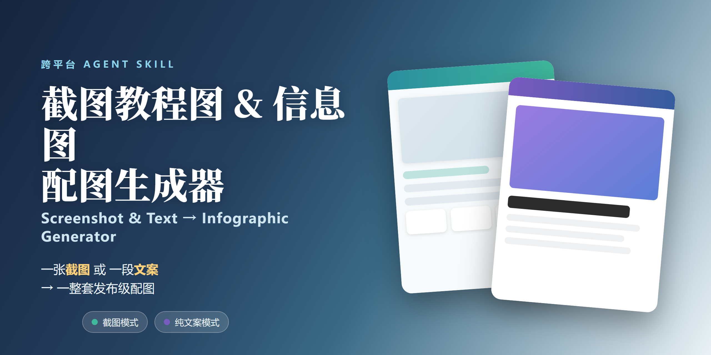

> 🔖 **搜索关键词**：截图生成教程图 · 功能讲解图 · 产品导览图 · 小红书配图 · 杂志风信息图 · infographic generator · screenshot tutorial · text to infographic · AI 插图 · 3D 插画 · Claude Code skill · Codex skill · Hermes skill · 跨平台 skill

---

## 📑 目录

- [它能帮你解决什么](#-它能帮你解决什么)
- [效果预览（直接看图）](#-效果预览直接看图)
- [两种用法](#-两种用法)
  - [方式一：截图 → 教程图](#方式一截图--教程图)
  - [方式二：纯文案 → 杂志风信息图](#方式二纯文案--杂志风信息图)
- [安装（一步步来）](#-安装一步步来)
- [支持哪些 AI 客户端（跨平台通用）](#-支持哪些-ai-客户端跨平台通用)
- [怎么用（核心是“对 AI 说一句话”）](#-怎么用核心是ai-说一句话)
- [配置（可选）](#-配置可选)
- [工作原理（技术向，可跳过）](#-工作原理技术向可跳过)
- [目录结构](#-目录结构)
- [环境要求与跨平台注意事项](#-环境要求与跨平台注意事项)
- [常见问题 FAQ](#-常见问题-faq)
- [贡献 / 许可证 / 更新日志](#-贡献--许可证--更新日志)

---

## 💡 它能帮你解决什么

做产品教程图，最烦的是这几件事：

- **耗时**：一张一张截、裁、排版、配色，半天就过去了。
- **风格不统一**：每次做的颜色、圆角、字体都不一样，发出去像拼凑的。
- **不会排版**：想做得像小红书上那种「杂志风 + 3D 插画」，但自己搞不定。
- **要反复确认**：怕裁错区域、怕泄露隐私信息。

这个技能把上面全包了：

| 你只要做 | 它会给你 |
|---|---|
| 发一张截图 + 一段话 | 4~5 张成套教程图（风格自动跟随截图；可选 v1 经典 / v2 晚秋简约） |
| 发一段文案（主题） | 5~6 张杂志风信息图（每页自带 3D 插画） |

而且**出图前会先跟你确认方案**，不乱裁、不泄露。

---

## 🖼️ 效果预览（直接看图）

**① 截图模式** —— 下面这套基于「世界是一片荒原.AI 思维导图」的真实截图生成，展示的是 **v2「晚秋简约风」**（`--style v2` 开启）：品牌色从截图主色自动推导（降饱和压暗成高级感色）、金色小面积强调、全套只用 1px 细线分隔——没有彩虹功能色卡片、没有渐变徽章、没有重投影：

| 封面 · 独立传播用 | 第 1 张 · 总体概览 |
|---|---|
| 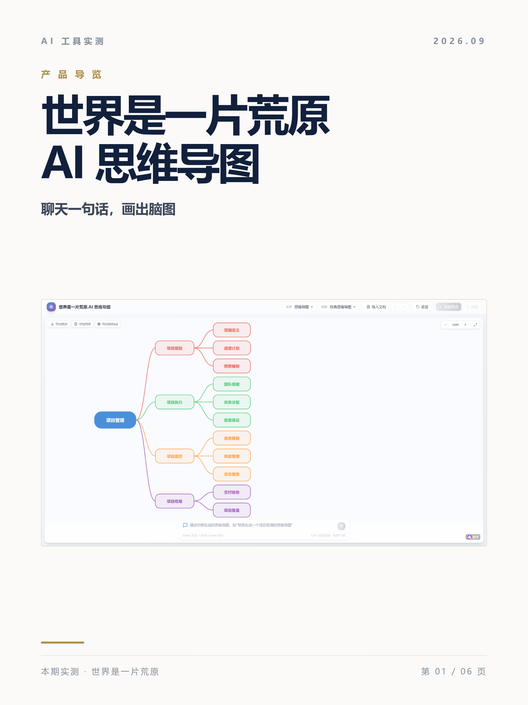 | 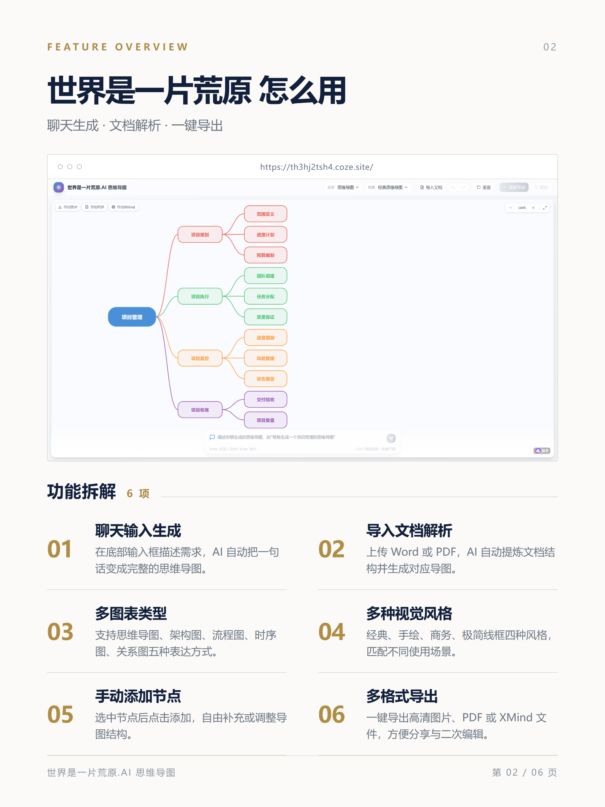 |

| 第 2 张 · 单个功能细节 | 第 3 张 · 单个功能细节 |
|---|---|
| 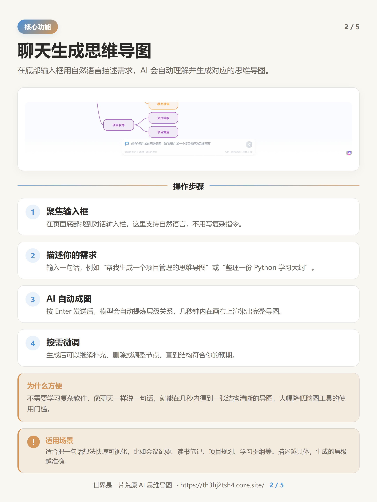 | 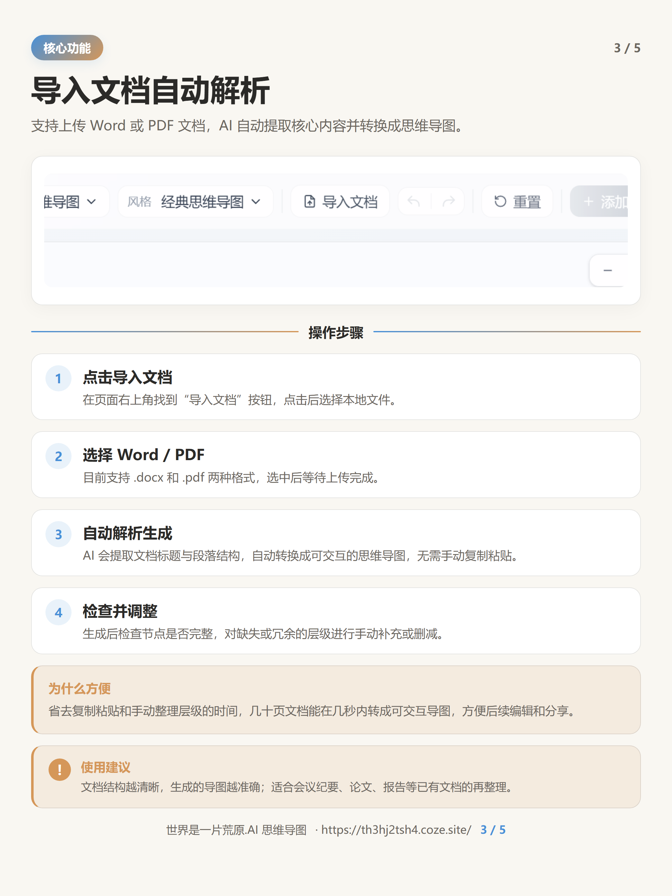 |

| 第 4 张 · 单个功能细节 |
|---|
| 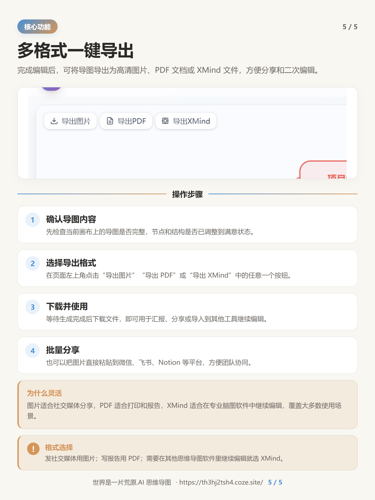 |

> 截图模式有两种风格：**v2 晚秋简约风**（上图，命令行 `--style v2` 或对 AI 说「用 v2 风格」）和 **v1 经典风**（跟随截图配色 + 功能色卡片）。默认仍是 v1，两种风格共用同一套截图识别与裁剪流程。

**② 纯文案模式** —— 你只给一个主题（这里以「Workflow 和 Agent 的区别」为例），AI 自动结构化 + 表意型排版，配色按主题自动推导：

| v2 封面（SVG 示意图编码内容） | v2 内容页（三列对比表） |
|---|---|
| 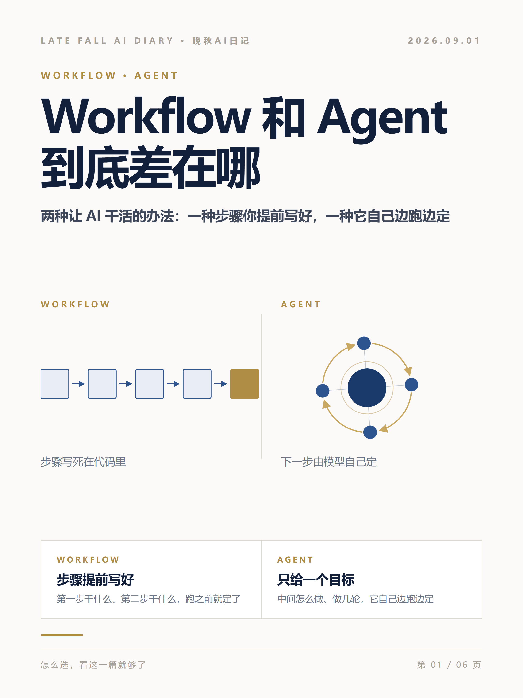 | 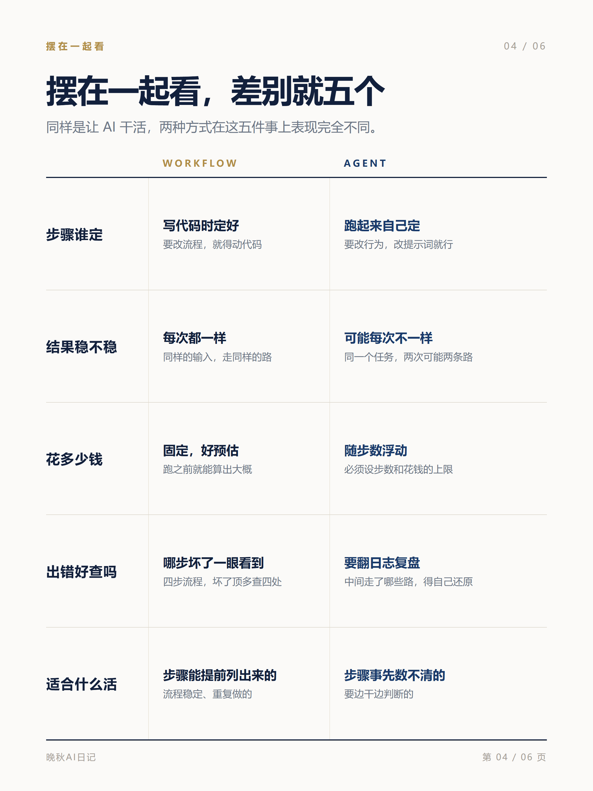 |
| 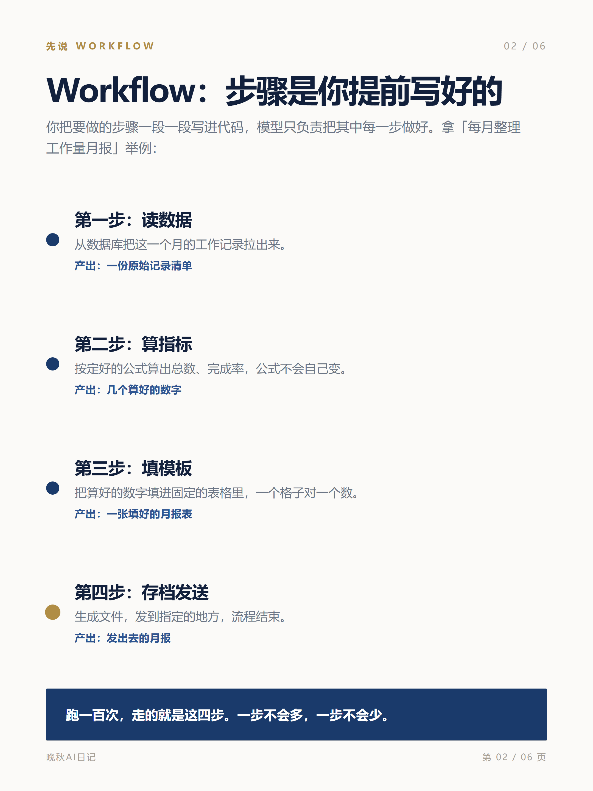 | 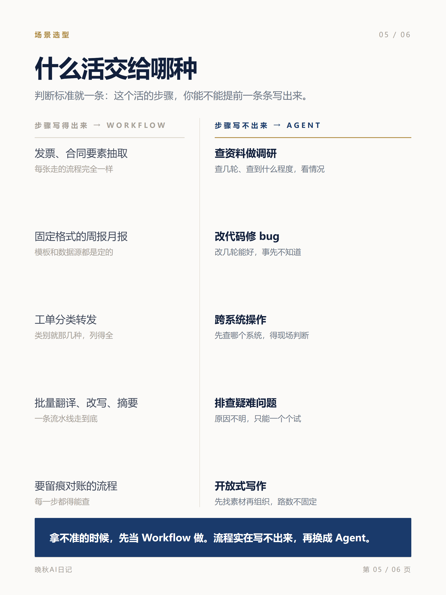 |

> 文案模式同样有两种风格：**v2 表意型排版**（上图，`--style v2`：视觉元素直接编码内容——竖链=因果、点阵=群体、时间线=演进，每页 flex 撑满不留白，零插画零成本）和 **v1 杂志风**（默认，3D 概念插画 + 杂志排版，配色按主题推导，下图）：

| v1 封面（文生图 3D 插画） | v1 核心规则页（插画完整不裁切） |
|---|---|
| 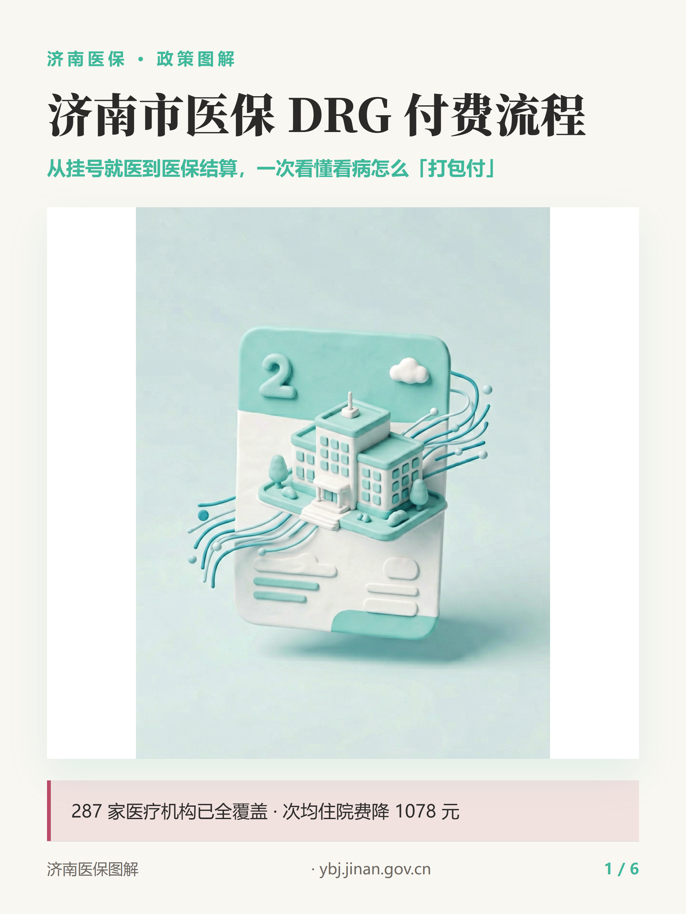 | 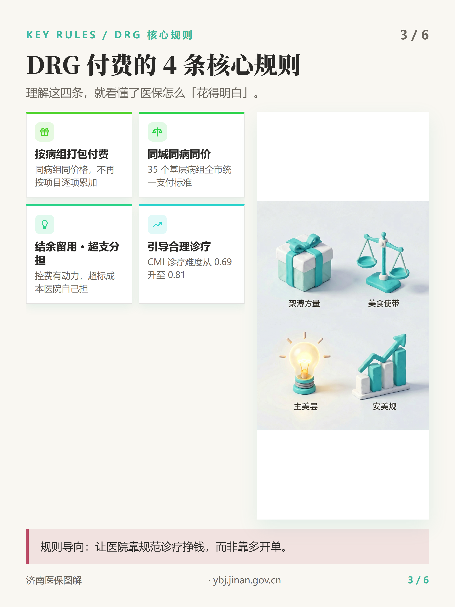 |
| 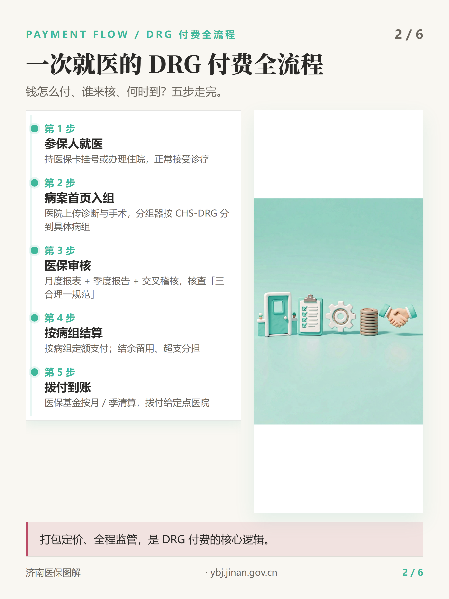 | 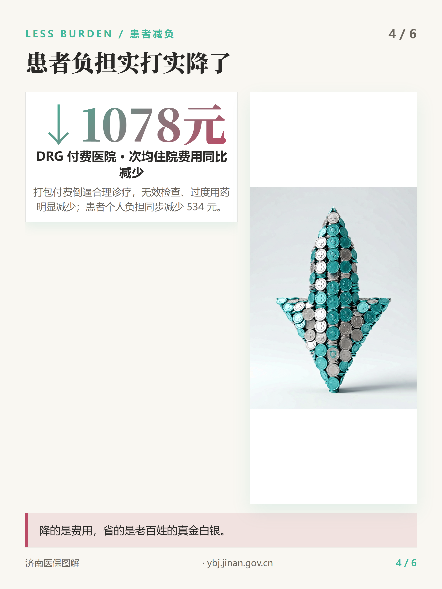 |

> 默认输出 **1080×1440 竖版 3:4** 高清 PNG（2× 渲染为 2160×2880），成套图带统一页脚与页码，发出去不用二次加工。

---

## 🔖 这个仓库叫什么 / 怎么搜到它

为了让更多人能在 GitHub / Google 搜到并装走这个技能，建议：

- **仓库名**：`screenshot-infographic-skill`（带 `skill` 后缀，便于被「skill」「教程图」类搜索命中）。
- **GitHub 仓库简介（About）** 填这一句：
  > AI skill：把一张截图或一段文字，自动生成一整套可直接发的小红书/公众号风格教程图与杂志风信息图（自带 3D 插画）。
- **GitHub Topics**（仓库 Settings → Topics 里添加，能显著提升被检索到的概率）：
  `ai` · `infographic` · `tutorial` · `screenshot` · `skill` · `xiaohongshu` · `image-generation` · `text-to-image` · `claude-skill` · `workbuddy` · `python` · `html-to-image` · `3d-illustration`

---

## 🚀 两种用法

### 方式一：截图 → 教程图

**你发给 AI 的**：一张产品截图 + 一段功能描述。
**AI 还给你的**：1 张概览图（把全部功能拆成卡片）+ 若干张单功能细节图（自动裁出对应区域）。支持两种风格：**v1 经典风**（默认，跟随截图配色 + 功能色卡片）和 **v2 晚秋简约风**（`--style v2`，单一品牌色 + 1px 细线，见上方预览）。

适合：软件/网站/小程序/后台系统的功能介绍、上手教程。

### 方式二：纯文案 → 信息图

**你发给 AI 的**：一段主题文案（比如“帮我做 5 张关于 XX 的科普配图”）。
**AI 还给你的**：1 张封面 + 若干内容页。支持两种风格：**v2 表意型排版**（`--style v2`，纯排版零插画，视觉元素直接编码内容）和 **v1 杂志风**（默认，每页自动配一张 3D 概念插画，配色按主题自动推导）。

适合：知识科普、活动预告、产品种草、资讯解读——**手头没有现成截图也能做**。

---

## 📦 安装（一步步来）

### 你需要先准备什么（前置条件）

1. **Python 3.10 或以上**（不确定版本？终端里敲 `python --version` 看一眼）。
2. **一台带浏览器的电脑**，用于把排版渲染成图片：
   - Windows → 需要 Microsoft Edge
   - macOS → 需要 Chrome
   - Linux → 需要 Chromium
3. **（可选但推荐）** OCR 库 `rapidocr-onnxruntime`：装了之后能自动识别截图里按钮的位置，裁图更准。不装也能用，只是定位精度略降。

### 方法 A：让 AI 帮你装（最省事，推荐）

如果你用的是支持「技能（Skill）」的 AI 客户端（Claude Code / Codex / Hermes / WorkBuddy 都支持），直接对它说：

> 帮我把这个 GitHub 仓库克隆到我的技能目录并安装依赖：
> `https://github.com/Wanqiu12345/screenshot-infographic-skill`
> 克隆完成后运行里面的 `install.py`。

AI 会自动完成：克隆 → 放进对应技能目录（Claude Code 用 `~/.claude/skills/`、Codex 用 `~/.agents/skills/`、Hermes 用 `~/.hermes/skills/`、WorkBuddy 用 `~/.workbuddy/skills/`）→ 运行 `python install.py` 装好依赖并检测浏览器。装完就能在对话里直接用。

### 方法 B：自己手动装（命令行）

```bash
# 1) 把仓库下载到本地
git clone https://github.com/Wanqiu12345/screenshot-infographic-skill.git
cd screenshot-infographic-skill

# 2) 一键安装：创建隔离环境 + 装依赖 + 检测浏览器
python install.py

# 3) 装好后，把整个文件夹复制到你的技能目录：
#    Windows: C:\Users\<你的用户名>\.workbuddy\skills\   （WorkBuddy）
#    macOS/Linux: ~/.workbuddy/skills/                      （WorkBuddy）
#    跨平台：Claude Code → ~/.claude/skills/    Codex → ~/.agents/skills/    Hermes → ~/.hermes/skills/
```

> 💡 装完之后，你**不需要再碰命令行**。日常使用就是在对话里发截图 / 发文字，让 AI 调用这个技能就行。

### 怎么确认装好了？

手动装的话，跑一句验证（不需要截图，用自带的示例）：

```bash
python run_screenshot_tutorial.py
```

如果 `output/` 目录里出现了 `00_cover.png`（极简传播封面）和 `01_overview.png` 等几张图，说明安装成功 ✅。想顺便看看 v2 晚秋简约风的效果，改跑：

```bash
python run_screenshot_tutorial.py --style v2
```

---

## 🌐 支持哪些 AI 客户端（跨平台通用）

本技能遵循 **Agent Skills 开放标准（agentskills.io）**，技能目录结构（一个 `SKILL.md` + 可选 `scripts/`、`references/`、`assets/`）在主流编码智能体之间**通用**，无需改写：

| 客户端 | 技能目录 | 状态 |
|---|---|---|
| **Claude Code** | `~/.claude/skills/` | ✅ 原生支持（与本项目格式一致） |
| **OpenAI Codex** | `~/.agents/skills/`（或仓库内 `.agents/skills/`） | ✅ 原生支持（Codex 2025-12 起支持 Agent Skills） |
| **Hermes** | `~/.hermes/skills/`（还支持 `external_dirs` 直接扫描共享的 `~/.agents/skills/`） | ✅ 原生支持 |
| **WorkBuddy** | `~/.workbuddy/skills/` | ✅ 原生支持 |

> 技能里的 Python 脚本靠终端执行，上述工具都具备终端 / 代码执行能力，所以**脚本直接跑、不用改**。
> 展示成图时：WorkBuddy 用 `present_files` 一次性预览；其他工具直接打开生成的 `output/*.png` 文件即可，不影响出图。

---

## 🎯 怎么用（核心是“对 AI 说一句话”）

最常用、最推荐的方式就是**在对话里直接说**。下面这些话可以直接复制粘贴给你的 AI 助手（前提是对方装了本技能）。

### 场景一：你有一张截图，想做功能教程图

> 用 `screenshot-infographic-skill` 技能，根据这张截图给我做一套功能教程图。
> 功能包括：聊天生成导图、导入文档解析、图表类型切换、多格式导出。
> 用 v2 晚秋简约风。
> 品牌名：世界是一片荒原.AI 思维导图，网址：https://th3hj2tsh4.coze.site/

把你的截图**拖进对话框**，再补一句功能描述即可。技能会**先回述方案让你确认，再出图**，不会乱裁。
风格不指定就出 v1 经典风（跟随截图配色 + 功能色卡片）；想要上方预览那种简约版，在话术里加一句「**用 v2 晚秋简约风**」即可，不用提供任何色值。

### 场景二：你只有一段文案，想做主题配图

> 用 `screenshot-infographic-skill` 技能，根据下面这个主题给我做 5 张小红书风格的配图。
> 主题：济南市医保 DRG 支付流程。
> 文案如下：
> 【把你的文案贴在这里，或只给主题也行】

该模式会自动：识别文案主题并匹配配色 → 把文案拆成多页结构化内容 → 用文生图生成每页 3D 插画 → 杂志风排版成套出图。

### 命令行用法（进阶 / 批量自动化）

如果你更喜欢命令行，或要批量生成：

**截图模式**

```bash
# 默认已带“世界是一片荒原.AI 思维导图”示例截图，可直接跑通演示
python run_screenshot_tutorial.py
# 换成 v2「晚秋简约风」（单一品牌色 + 1px 细线，效果见上方预览）：
python run_screenshot_tutorial.py --style v2
# 换成你自己的截图：
# Windows
set SCREENSHOT=D:/path/to/your.png
python run_screenshot_tutorial.py --style v2
# macOS / Linux
SCREENSHOT=/path/to/your.png python run_screenshot_tutorial.py --style v2
```

**纯文案模式**

```bash
# 1) 让 AI 把你的文案结构化后写入一个 json（字段规范见 references/text_mode_design.md）
# 2) 运行端到端脚本，输出到 output_text/
python run_text_tutorial.py my_text.json --out output_text
# 想要 v2 表意型排版（纯排版零插画）：
python run_text_tutorial.py my_text.json --style v2 --out output_text
# 参考示例：examples/wf_agent_v2.json（Workflow vs Agent 主题）

# 小技巧：v1 杂志风如果文生图比较慢，可以先并行把 3D 插画生成好，再复用渲染，省时间：
python scripts/generate_text_images.py my_text.json --out output_text --workers 3
python run_text_tutorial.py my_text.json --out output_text --use-existing
```

### 关于「确认门」（为什么它不会乱出图）

出图前，技能会把下面这些**先念给你听、等你点头**：

- 主题判断（明暗 / 主色）
- 功能清单（会做成哪几张图）
- 每张细节图对应截图里的**哪个区域**
- 品牌页脚写什么

如果你描述的功能名称不确切、或截图定位不准，它会**先问你**再继续。一句话：**宁可多问，不出错图。**

---

## ⚙️ 配置（可选）

大多数情况**装好就能用**，下面这些不是必填。

### 1) 文生图密钥 AGNES_API_KEY（可省略）

纯文案模式的 3D 插画由 Agnes AI 生成。脚本里**内置了一个免费的兜底密钥**，所以：

- **什么都不用配**，直接就能出图（免费、国内站可直连）。
- 想用自己的账号 / 密钥，设个环境变量覆盖即可：

  ```bash
  # Windows
  set AGNES_API_KEY=sk-你的密钥
  # macOS / Linux
  export AGNES_API_KEY=sk-你的密钥
  ```

- 想彻底移除内置密钥：把 `scripts/agnes_image.py` 里的 `FALLBACK_API_KEY` 置空即可。

### 2) 配色主题（截图模式自动跟随；文案模式可指定）

纯文案模式支持按**主题分类**或**命名预设**自动配色，不再写死奶油白（仅 v1 杂志风；**v2 表意型排版零配置**，主色在 json 的 `primary` 里指定或自动推导）：

- `category`：如 `AI/科技`、`财经`、`美食`、`教育`、`医疗`、`职场` 等，自动匹配合适色系。
- `preset`：如 `cream`（奶油）、`redbook`（小红书）、`obsidian`（暗黑）、`cyber`（科技）、`forest`（森系）、`ocean`（海洋）等。
- `theme`：`light` / `dark` 明暗偏好。

在文案 json 里写上 `category` 或 `preset` 字段即可，详见 `references/text_mode_design.md`。

> 截图模式的 v2 晚秋简约风**不需要任何配色配置**：品牌色直接从你的截图主色自动推导（降饱和压暗），金色强调色内置，没有可调项也没有必填项。

### 3) 品牌页脚

给品牌名 → 页脚显示「名 + 页码」；给品牌名 + 网址 → 「名 + 网址 + 页码」；都不给 → 自动不加页脚。聪明处理，不会留空白占位。

---

## 🔧 工作原理（技术向，可跳过）

截图模式整体流水线：

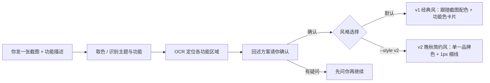

两种风格**共用同一条识别与裁剪流水线**，只切换视觉语言：v1 由专业色彩系统推导主色 + 6 个功能色；v2 把截图主色降饱和压暗成单一品牌色，配金色小面积强调，整页只用 1px 细线分隔。

纯文案模式整体流水线：

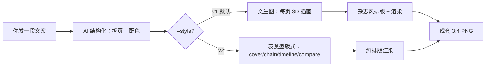

底层关键技术点：

- **专业色彩系统**：基于 60-30-10、色轮和谐、WCAG 对比度，自动推导主色 / 辅色 / 互补强调色 / 6 个功能色，避免“一片灰”或“太花哨”。
- **文生图卡顿自愈**：超时放宽 + 单图失败自动重试 + 收尾补漏（缺失的图会自动再跑一遍），不会静默丢图。
- **保留可编辑 HTML**：每张成图同时保留 HTML 源文件，方便二次修改后重渲染。

---

## 📁 目录结构

```text
screenshot-infographic-skill/
├── SKILL.md                      # 主指令（AI 客户端触发用）
├── README.md                     # 本文件
├── LICENSE                       # MIT 许可证
├── CHANGELOG.md                  # 版本更新记录
├── CONTRIBUTING.md               # 贡献指南（给开发者）
├── requirements.txt              # Python 依赖
├── install.py                    # 一键安装脚本
├── run_screenshot_tutorial.py    # 截图模式：命令行入口
├── run_text_tutorial.py          # 纯文案模式：命令行入口
├── scripts/
│   ├── extract_theme.py          # 截图取色 / 明暗 / 圆角
│   ├── color_system.py           # 专业色彩系统
│   ├── crop_region.py            # 按坐标裁剪功能区域
│   ├── ocr_locate.py             # OCR 文字定位
│   ├── extract_favicon.py        # 提取浏览器标签页 favicon 作 logo
│   ├── screenshot_v2.py          # 截图模式 v2「晚秋简约风」渲染器（--style v2）
│   ├── text_v2.py                # 纯文案模式 v2「表意型排版」渲染器（--style v2）
│   ├── fill_template.py          # 组装 HTML 模板
│   ├── render.py                 # 无头浏览器渲染 PNG
│   ├── agnes_image.py            # Agnes 免费文生图封装（内置兜底密钥）
│   └── generate_text_images.py   # 纯文案模式：并行生成 3D 插画（带自愈）
├── templates/
│   ├── cover.html                # 极简传播封面模板（双模式复用）
│   ├── overview.html             # 截图模式概览图模板
│   ├── detail.html               # 截图模式细节图模板
│   ├── text_cover.html           # 纯文案模式丰富封面模板
│   └── text_section.html         # 纯文案模式内容页模板（8 种版式）
├── references/
│   ├── design_notes.md           # 截图模式配置结构与调用链
│   ├── color_guide.md            # 配色系统原理
│   ├── agnes_image_guide.md      # Agnes 图片模型接入与降级策略
│   └── text_mode_design.md       # 纯文案模式 schema 与版式规范
└── examples/                      # 示例与输出（含本 README 预览图）
    ├── screenshot.png            # 示例截图
    ├── 00_cover.png              # 截图模式极简封面示例
    ├── 01_overview.png …         # 截图模式示例输出
    ├── jinan_drg.json            # 纯文案模式示例配置（济南医保 DRG 主题）
    ├── jinan_drg_*.png            # 纯文案模式 v1 示例输出
    ├── wf_agent_v2.json          # 纯文案模式 v2 示例配置（Workflow vs Agent 主题）
    └── wf_agent_v2_*.png          # 纯文案模式 v2 示例输出
```

---


## 🧰 环境要求与跨平台注意事项

这套技能是**纯 Python + 无头浏览器**，理论上任何装了 Python 的电脑都能跑。但有几个真实坑，提前说清楚能省你两小时：

### 1. 必须装一个 Chromium 内核浏览器（渲染依赖）
出图靠系统浏览器无头渲染，所以机器上**必须有 Edge / Chrome / Chromium 之一**（`render.py` 会自动查找）：

- **Windows**：装 Microsoft Edge 或 Chrome（通常已自带）。
- **macOS**：装 Chrome（或 Edge）。
- **Linux 服务器 / 容器（最常见踩坑点）**：大多数云服务器**默认没有**浏览器，需要手动装：
  ```bash
  # Debian / Ubuntu
  sudo apt-get update && sudo apt-get install -y chromium
  # RHEL / Fedora
  sudo dnf install -y chromium
  # Arch
  sudo pacman -S chromium
  ```
  容器环境（Docker、Codex / Hermes 的沙箱）里若无 `--no-sandbox` 会崩，本技能已在 `render.py` 内置该参数和 `--disable-dev-shm-usage`，一般可直接用。

> 没装浏览器时 `render.py` 会明确报错并给出上面的安装命令，不会静默出空图。

### 2. 3D 插画（Agnes）有地区限制 —— 连不上会自动降级
纯文案模式的每页 3D 插画、以及截图模式的可选增强，调用 **Agnes AI**（`apihub.agnes-ai.com`）。该端点**主要面向中国大陆网络可直连**；海外或受限网络可能连不上。

- 连不上时：脚本会**快速探测并自动跳过插画**，直接渲染排版占位图，**不会卡住、不会崩溃**（纯文案模式也不会傻等数小时重试）。
- 想要插画：设置你自己的 key 并确保网络可直连：
  ```bash
  export AGNES_API_KEY=sk-xxx     # Windows: set AGNES_API_KEY=sk-xxx
  ```
- 仓库内置了一个**共享演示 key**仅供零配置体验，有速率限制；生产或频繁使用、或处于海外网络，请务必自配 `AGNES_API_KEY`（到 https://agnes-ai.com 注册获取）。

### 3. Python 虚拟环境（venv）
`install.py` 会在本目录建隔离 `.venv` 并装依赖。Linux 上若提示 `ensurepip` / `venv` 缺失，先装：
```bash
sudo apt-get install -y python3-venv python3-pip   # Debian/Ubuntu
```

### 4. OCR 首次运行会下载模型
定位按钮用的 `rapidocr-onnxruntime` 在**第一次运行时会联网下载模型文件**（几十 MB），之后离线可用。若网络受限导致 OCR 失败，技能会自动降级为「目测 → 裁剪验证 → 九宫格指认」，不影响出图。

### 5. 路径与权限
所有脚本都用**相对路径**（`__file__` 基准），复制到任意机器、任意目录都能跑，**没有写死作者本机路径**。输出默认落在技能目录下的 `output/`（截图模式）与 `output_text/`（纯文案模式），已加入 `.gitignore`，不会污染源码。


## ❓ 常见问题 FAQ

**Q：图片生成卡住 / 失败了怎么办？**
A：纯文案模式的文生图依赖外部服务，高峰期偶尔会慢或临时 5xx。脚本已内置**自愈机制**：单图超时后自动重试，全部跑完还会**自动检查缺哪张、把失败的单独再跑一遍**，不会悄悄丢图。真遇到长时间不出，可加 `--workers 1` 串行重试，或稍后重跑（已生成的图会被复用，不会重复消耗）。

**Q：AGNES_API_KEY 是什么？收费吗？**
A：是纯文案模式生成 3D 插画的图片模型密钥。脚本**内置了免费兜底密钥**，开箱即用、不收费。想用自己的账号随时可设环境变量覆盖。

**Q：生成的图分辨率是多少？**
A：默认 1080×1440 竖版 3:4（2× 渲染为 2160×2880 高清）。适合小红书 / 公众号竖图。

**Q：配色能自己定吗？还是只能奶油白？**
A：不写死奶油白。截图模式跟随原图；纯文案模式按主题/预设自动推导（科技→冷蓝青、医疗→青绿、美食→暖橙……），也可在 json 里指定 `preset`。

**Q：截图模式的两种风格怎么选？**
A：命令行加 `--style v2`（或对 AI 说「用 v2 晚秋简约风」）得到单一品牌色 + 1px 细线的简约版，适合追求高级感、信息密度高的场景；不加参数则是 v1 经典风（跟随截图配色 + 功能色卡片）。v2 的品牌色也是从你的截图自动推导的，不用手动指定色值。

**Q：什么是「确认门」？**
A：出图前技能会把主题、功能清单、每张图对应截图哪个区域、页脚内容先念给你确认，宁可多问不出错图。如果你描述含糊或定位不准，它会先问你。

**Q：必须装浏览器吗？**
A：是的，渲染用系统无头浏览器（Windows=Edge / macOS=Chrome / Linux=Chromium）才能完整支持渐变、阴影、字体等效果，成图质量远高于纯拼图。`install.py` 会自动检测。

**Q：生成的图能商用吗？**
A：工具本身 MIT 开源，你生成的图归你，可自由商用。但请留意截图里是否含第三方敏感信息或版权内容。

**Q：命令行跑出来的图在哪？**
A：截图模式在 `output/`，纯文案模式在 `output_text/`（这两个目录已加入 `.gitignore`，不会污染源码）。

---

## 🤝 贡献 / 许可证 / 更新日志

- **想一起完善？** 欢迎提 Issue 和 PR，请看 [CONTRIBUTING.md](CONTRIBUTING.md)。
- **许可证**：MIT，详见 [LICENSE](LICENSE)。
- **更新记录**：版本与改动明细见 [CHANGELOG.md](CHANGELOG.md)。

---

Made for people who hate making tutorial screenshots by hand. 🙌
