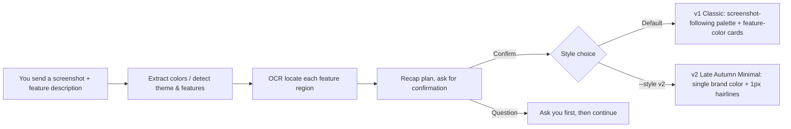
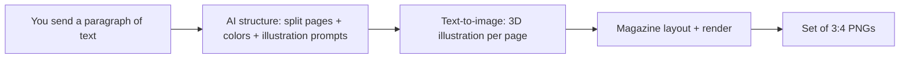

# 📸 Screenshot & Text → Infographic Generator

> 🇨🇳 中文文档：[README.md](README.md)

> **In one sentence**: Send it *one screenshot* or *a paragraph of text*, and it auto-generates a complete set of on-brand tutorial / magazine-style infographic images — ready to post on Xiaohongshu (RED), WeChat, or any community. No design skills, no Photoshop, no coding.

[](LICENSE)
[](requirements.txt)
[](https://agnes-ai.com)


> 🔖 **Search keywords**: infographic generator · screenshot tutorial · text to infographic · feature guide image · xiaohongshu visual · magazine-style infographic · 3D illustration · Claude Code skill · Codex skill · Hermes skill · cross-platform skill

---

## 📑 Table of Contents

- [What it does for you](#what-it-does-for-you)
- [Preview (see the images)](#preview-see-the-images)
- [Repo name / how people find it](#repo-name--how-people-find-it)
- [Two ways to use it](#two-ways-to-use-it)
  - [Mode 1: Screenshot → tutorial images](#mode-1-screenshot--tutorial-images)
  - [Mode 2: Plain text → magazine-style infographics](#mode-2-plain-text--magazine-style-infographics)
- [Installation (step by step)](#installation-step-by-step)
- [Which AI clients are supported (cross-platform)](#which-ai-clients-are-supported-cross-platform)
- [How to use it (just talk to your AI)](#how-to-use-it-just-talk-to-your-ai)
- [Configuration (optional)](#configuration-optional)
- [How it works (technical, skippable)](#how-it-works-technical-skippable)
- [Directory structure](#directory-structure)
- [Environment requirements & cross-platform notes](#environment-requirements--cross-platform-notes)
- [FAQ](#faq)
- [Contributing / License / Changelog](#contributing--license--changelog)

---

## 💡 What it does for you

Making product tutorial images is painful mostly because of these:

- **Time-consuming**: cropping, layout, color matching one image at a time eats a whole afternoon.
- **Inconsistent style**: every time the colors, corners, and fonts differ, so the final set looks patched together.
- **No layout skills**: you want that "magazine + 3D illustration" look from Xiaohongshu but can't pull it off yourself.
- **Constant double-checking**: afraid of cropping the wrong region or leaking private info.

This skill handles all of the above:

| All you do | What you get |
|---|---|
| Send one screenshot + a short description | 4~5 matching tutorial images (style auto-follows the screenshot; v1 Classic / v2 Late Autumn Minimal) |
| Send a paragraph / a topic | 5~6 magazine-style infographics (each with a 3D illustration) |

And **before generating, it confirms the plan with you** — no wrong crops, no leaks.

---

## 🖼️ Preview (see the images)

**① Screenshot mode** — generated from a real screenshot of "世界是一片荒原.AI 思维导图" (a mind-map product), shown in the **v2 "Late Autumn Minimal" style** (enable with `--style v2`): the brand color is auto-derived from the screenshot's dominant color (desaturated and darkened for a premium feel) with a small gold accent; the whole set is separated by 1px hairlines only — no rainbow feature-color cards, no gradient badges, no heavy drop shadows:

| Cover · standalone share image | Image 1 · Overview |
|---|---|
|  |  |

| Image 2 · Single-feature detail | Image 3 · Single-feature detail |
|---|---|
|  |  |

| Image 4 · Single-feature detail |
|---|
|  |

> Screenshot mode ships with two styles: **v2 Late Autumn Minimal** (shown above; CLI `--style v2`, or just tell your AI "use the v2 style") and **v1 Classic** (follows the screenshot's palette + feature-color cards). v1 remains the default; both styles share the same screenshot-recognition and cropping pipeline.

**② Plain-text mode** — give it just a topic (here, "Jinan medical insurance DRG payment flow" as an example). It auto-structures the text, generates 3D illustrations, and lays it out magazine-style; colors are derived from the topic (medical → teal/green):

| Cover (text-to-image 3D illustration) | Core-rules page (illustration fully visible, not cropped) |
|---|---|
|  |  |
|  |  |

> Default output is **1080×1440 portrait 3:4** HD PNG (rendered at 2× → 2160×2880). The set ships with a unified footer and page numbers, ready to post with zero post-processing.

---

## 🔖 Repo name / how people find it

To help more people discover and install this skill via GitHub / Google, we recommend:

- **Repo name**: `screenshot-infographic-skill` (the `skill` suffix helps it surface in "skill" / "tutorial image" searches).
- **GitHub repo About** text:
  > AI skill: turn a screenshot or a paragraph of text into a complete set of ready-to-post Xiaohongshu / WeChat-style tutorial images and magazine-style infographics (with built-in 3D illustrations).
- **GitHub Topics** (repo Settings → Topics; strongly boosts discoverability):
  `ai` · `infographic` · `tutorial` · `screenshot` · `skill` · `xiaohongshu` · `image-generation` · `text-to-image` · `claude-skill` · `workbuddy` · `python` · `html-to-image` · `3d-illustration`

---

## 🚀 Two ways to use it

### Mode 1: Screenshot → tutorial images

**You send the AI**: one product screenshot + a feature description.
**The AI returns**: 1 overview image (all features broken into cards) + several single-feature detail images (the relevant region auto-cropped). Two styles available: **v1 Classic** (default; follows the screenshot's palette + feature-color cards) and **v2 Late Autumn Minimal** (`--style v2`; single brand color + 1px hairlines, see the preview above).

Great for: feature intros, getting-started guides for software / websites / mini-programs / admin panels.

### Mode 2: Plain text → magazine-style infographics

**You send the AI**: a topic paragraph (e.g. "make me 5 science-popularization images about XX").
**The AI returns**: 1 magazine-style cover + several content pages, each auto-paired with a 3D concept illustration; colors derived from the topic.

Great for: knowledge explainers, event teasers, product pitches, news breakdowns — **works even when you have no screenshot on hand**.

---

## 📦 Installation (step by step)

### What you need first (prerequisites)

1. **Python 3.10 or above** (not sure? run `python --version` in a terminal).
2. **A computer with a browser**, used to render layouts into images:
   - Windows → Microsoft Edge
   - macOS → Chrome
   - Linux → Chromium
3. **(Optional but recommended)** the OCR library `rapidocr-onnxruntime`: enables auto-detecting button positions in screenshots for more accurate crops. Works without it too, just slightly less precise.

### Method A: Let the AI install it for you (easiest, recommended)

If you use an AI client that supports "Skills" (Claude Code / Codex / Hermes / WorkBuddy all do), just tell it:

> Clone this GitHub repo into my skills directory and install dependencies:
> `https://github.com/Wanqiu12345/screenshot-infographic-skill`
> After cloning, run `install.py` inside it.

The AI will: clone → drop it into the right skills directory (Claude Code → `~/.claude/skills/`, Codex → `~/.agents/skills/`, Hermes → `~/.hermes/skills/`, WorkBuddy → `~/.workbuddy/skills/`) → run `python install.py` to install deps and detect the browser. Done — you can use it in chat right away.

### Method B: Install manually (command line)

```bash
# 1) Download the repo locally
git clone https://github.com/Wanqiu12345/screenshot-infographic-skill.git
cd screenshot-infographic-skill

# 2) One-click install: isolated venv + dependencies + browser detection
python install.py

# 3) After install, copy the whole folder into your skills directory:
#    Windows: C:\Users\<your-user>\.workbuddy\skills\   (WorkBuddy)
#    macOS/Linux: ~/.workbuddy/skills/                 (WorkBuddy)
#    Cross-platform: Claude Code → ~/.claude/skills/   Codex → ~/.agents/skills/   Hermes → ~/.hermes/skills/
```

> 💡 After install you **never touch the command line again**. Daily use is just sending screenshots / text in chat and letting the AI invoke this skill.

### How to confirm it installed correctly?

If you installed manually, run a quick check (no screenshot needed — uses the bundled example):

```bash
python run_screenshot_tutorial.py
```

If `output/` now contains `00_cover.png` (minimalist share cover) and `01_overview.png` etc., install succeeded ✅. To also preview the v2 Late Autumn Minimal style, run:

```bash
python run_screenshot_tutorial.py --style v2
```

---

## 🌐 Which AI clients are supported (cross-platform)

This skill follows the **open Agent Skills standard (agentskills.io)**. The skill directory layout (a `SKILL.md` + optional `scripts/`, `references/`, `assets/`) is **shared across mainstream coding agents** — no rewrite needed:

| Client | Skills directory | Status |
|---|---|---|
| **Claude Code** | `~/.claude/skills/` | ✅ Native (same format as this project) |
| **OpenAI Codex** | `~/.agents/skills/` (or in-repo `.agents/skills/`) | ✅ Native (Codex supports Agent Skills since 2025-12) |
| **Hermes** | `~/.hermes/skills/` (also `external_dirs` to scan shared `~/.agents/skills/`) | ✅ Native |
| **WorkBuddy** | `~/.workbuddy/skills/` | ✅ Native |

> The Python scripts run in a terminal, which all the tools above support, so **the scripts just run — no changes**.
> When showing results: WorkBuddy uses `present_files` for a one-shot preview; other tools just open the generated `output/*.png` directly. Either way, images are produced fine.

---

## 🎯 How to use it (just talk to your AI)

The most common and recommended way is **just say it in chat**. The prompts below can be copied straight to your AI assistant (assuming the skill is installed).

### Scenario 1: you have a screenshot, want feature tutorial images

> Use the `screenshot-infographic-skill` skill to make a set of feature tutorial images from this screenshot.
> Features include: chat-to-mindmap, import-doc parsing, chart-type switching, multi-format export.
> Use the v2 Late Autumn Minimal style.
> Brand name: 世界是一片荒原.AI 思维导图, website: https://th3hj2tsh4.coze.site/

**Drag your screenshot into the chat box** and add a feature description. The skill will **recap the plan and wait for your OK before generating** — no wrong crops.
Without a style hint you get v1 Classic (screenshot-following palette + feature-color cards). For the minimal look shown in the preview above, just add "**use the v2 Late Autumn Minimal style**" — no color values needed.

### Scenario 2: you only have text, want a topic-based visual

> Use the `screenshot-infographic-skill` skill to make 5 Xiaohongshu-style images from this topic.
> Topic: Jinan medical insurance DRG payment flow.
> Copy of the text:
> 【paste your text here, or just give the topic】

This mode auto: detects the topic and matches colors → splits text into structured pages → text-to-image generates a 3D illustration per page → magazine layout, output as a set.

### Command-line usage (advanced / batch automation)

If you prefer the command line, or need batch generation:

**Screenshot mode**

```bash
# Bundled example "世界是一片荒原.AI 思维导图" screenshot — runs the demo out of the box
python run_screenshot_tutorial.py
# Switch to the v2 "Late Autumn Minimal" style (single brand color + 1px hairlines, see preview above):
python run_screenshot_tutorial.py --style v2
# Use your own screenshot:
# Windows
set SCREENSHOT=D:/path/to/your.png
python run_screenshot_tutorial.py --style v2
# macOS / Linux
SCREENSHOT=/path/to/your.png python run_screenshot_tutorial.py --style v2
```

**Plain-text mode**

```bash
# 1) Have the AI structure your text into a json (field spec: references/text_mode_design.md)
# 2) Run the end-to-end script, output to output_text/
python run_text_tutorial.py my_text.json --out output_text

# Tip: if text-to-image is slow, pre-generate the 3D illustrations in parallel, then reuse for render:
python scripts/generate_text_images.py my_text.json --out output_text --workers 3
python run_text_tutorial.py my_text.json --out output_text --use-existing
```

### About the "confirmation gate" (why it won't generate recklessly)

Before generating, the skill will **read the plan back to you and wait for a nod** on:

- Theme judgment (light/dark, main color)
- Feature list (which images will be made)
- Which region of the screenshot each detail image corresponds to
- What the brand footer should say

If your feature names are vague or screenshot localization is off, it will **ask you first**. One line: **better to ask than to produce a wrong image.**

---

## ⚙️ Configuration (optional)

In most cases **it works right after install**; nothing below is required.

### 1) Image key AGNES_API_KEY (can be omitted)

The 3D illustrations in plain-text mode are generated by Agnes AI. The script ships **a free built-in fallback key**, so:

- **No config needed** — images generate out of the box (free, direct-connect from mainland China).
- To use your own account / key, override via an environment variable:

  ```bash
  # Windows
  set AGNES_API_KEY=sk-your-key
  # macOS / Linux
  export AGNES_API_KEY=sk-your-key
  ```

- To remove the built-in key entirely: empty `FALLBACK_API_KEY` in `scripts/agnes_image.py`.

### 2) Color theme (screenshot mode auto-follows; plain-text mode can specify)

Plain-text mode supports auto-coloring by **category** or **named preset** — no longer hard-coded to cream white:

- `category`: e.g. `AI/tech`, `finance`, `food`, `education`, `medical`, `career`, etc. → auto-matched palette.
- `preset`: e.g. `cream`, `redbook` (Xiaohongshu), `obsidian` (dark), `cyber` (tech), `forest`, `ocean`, etc.
- `theme`: `light` / `dark` preference.

Set `category` or `preset` in the text json; see `references/text_mode_design.md`.

> The screenshot mode's v2 Late Autumn Minimal style needs **zero color configuration**: the brand color is auto-derived from your screenshot's dominant color (desaturated and darkened), with a built-in gold accent — nothing to tune, nothing required.

### 3) Brand footer

Brand name only → footer shows "name + page number"; name + website → "name + website + page number"; neither → footer auto-omitted. Handled smartly, no blank placeholders.

---

## 🔧 How it works (technical, skippable)

Screenshot mode pipeline:



Both styles **share the same recognition & cropping pipeline** — only the visual language switches: v1 derives a primary color + 6 feature colors via the professional color system; v2 desaturates/darkens the screenshot's dominant color into a single brand color with a small gold accent, separated by 1px hairlines only.

Plain-text mode pipeline:



Key technical points under the hood:

- **Professional color system**: based on 60-30-10, color-wheel harmony, and WCAG contrast — auto-derives primary / secondary / complementary accent / 6 functional colors, avoiding "all gray" or "too garish".
- **Text-to-image stall self-healing**: relaxed timeout + per-image retry + final sweep (missing images auto-rerun), no silent drops.
- **Editable HTML retained**: every output image keeps its HTML source for easy re-render after edits.

---

## 📁 Directory structure

```text
screenshot-infographic-skill/
├── SKILL.md                      # Main instructions (what the AI client triggers on)
├── README.md                     # This file (Chinese)
├── README_EN.md                  # English version
├── LICENSE                       # MIT license
├── CHANGELOG.md                  # Version history
├── CONTRIBUTING.md               # Contributor guide (for developers)
├── requirements.txt              # Python dependencies
├── install.py                    # One-click install script
├── run_screenshot_tutorial.py    # Screenshot mode: CLI entry
├── run_text_tutorial.py          # Plain-text mode: CLI entry
├── scripts/
│   ├── extract_theme.py          # Screenshot color / lightness / corner extraction
│   ├── color_system.py           # Professional color system
│   ├── crop_region.py            # Crop feature regions by coordinates
│   ├── ocr_locate.py             # OCR text localization
│   ├── extract_favicon.py        # Extract browser-tab favicon as logo
│   ├── screenshot_v2.py          # Screenshot mode v2 "Late Autumn Minimal" renderer (--style v2)
│   ├── fill_template.py          # Assemble HTML templates
│   ├── render.py                 # Headless browser PNG render
│   ├── agnes_image.py            # Agnes free text-to-image wrapper (built-in fallback key)
│   └── generate_text_images.py   # Plain-text mode: parallel 3D illustration generation (with self-healing)
├── templates/
│   ├── cover.html                # Minimalist share cover template (both modes reuse)
│   ├── overview.html             # Screenshot mode overview template
│   ├── detail.html               # Screenshot mode detail template
│   ├── text_cover.html           # Plain-text mode rich cover template
│   └── text_section.html         # Plain-text mode content-page template (8 layouts)
├── references/
│   ├── design_notes.md           # Screenshot mode config structure & call chain
│   ├── color_guide.md            # Color system rationale
│   ├── agnes_image_guide.md      # Agnes model access & degradation strategy
│   └── text_mode_design.md       # Plain-text mode schema & layout spec
└── examples/                      # Examples & outputs (incl. README preview images)
    ├── screenshot.png            # Example screenshot
    ├── 00_cover.png              # Screenshot mode minimalist cover example
    ├── 01_overview.png …         # Screenshot mode example outputs
    ├── jinan_drg.json            # Plain-text mode example config (Jinan DRG topic)
    └── jinan_drg_*.png            # Plain-text mode example outputs
```

---

## 🧰 Environment requirements & cross-platform notes

This skill is **pure Python + headless browser**, so in theory any machine with Python can run it. But a few real pitfalls, spelled out upfront, will save you two hours:

### 1. You must have a Chromium-based browser (render dependency)

Images are rendered by your system browser headlessly, so the machine **must have Edge / Chrome / Chromium** (`render.py` auto-detects):

- **Windows**: Microsoft Edge or Chrome (usually pre-installed).
- **macOS**: Chrome (or Edge).
- **Linux server / container (the most common pitfall)**: most cloud servers **have no browser by default** — install manually:
  ```bash
  # Debian / Ubuntu
  sudo apt-get update && sudo apt-get install -y chromium
  # RHEL / Fedora
  sudo dnf install -y chromium
  # Arch
  sudo pacman -S chromium
  ```
  In containers (Docker, Codex / Hermes sandboxes) it crashes without `--no-sandbox`; this skill has built-in `--no-sandbox` and `--disable-dev-shm-usage` in `render.py`, so it generally just works.

> If no browser is installed, `render.py` errors clearly with the install command above — it won't silently output blank images.

### 2. 3D illustrations (Agnes) have regional limits — auto-degrades if unreachable

The per-page 3D illustrations in plain-text mode (and optional enhancements in screenshot mode) call **Agnes AI** (`apihub.agnes-ai.com`). This endpoint is **mainly directly reachable from mainland China networks**; overseas or restricted networks may fail to connect.

- If unreachable: the script **quickly probes and skips illustrations**, rendering layout placeholders instead — **no hang, no crash** (plain-text mode won't foolishly retry for hours either).
- Want illustrations: set your own key and ensure direct network access:
  ```bash
  export AGNES_API_KEY=sk-xxx     # Windows: set AGNES_API_KEY=sk-xxx
  ```
- The repo ships a **shared demo key** for zero-config体验 only, with rate limits; for production, frequent use, or overseas networks, please set your own `AGNES_API_KEY` (register at https://agnes-ai.com).

### 3. Python virtual environment (venv)

`install.py` creates an isolated `.venv` in this directory and installs deps. On Linux, if it complains `ensurepip` / `venv` missing, install first:
```bash
sudo apt-get install -y python3-venv python3-pip   # Debian/Ubuntu
```

### 4. OCR downloads models on first run

The button-localization `rapidocr-onnxruntime` **downloads model files on first run** (tens of MB), then works offline. If OCR fails due to restricted network, the skill auto-degrades to "visual estimate → crop verification → 3×3 grid pointing", without affecting output.

### 5. Paths & permissions

All scripts use **relative paths** (`__file__`-based), so they run on any machine / any directory — **no hard-coded author-local paths**. Output lands in `output/` (screenshot mode) and `output_text/` (plain-text mode) under the skill dir, both in `.gitignore`, so they never pollute the source.

---

## ❓ FAQ

**Q: Image generation hangs / fails — what do I do?**
A: Plain-text text-to-image depends on an external service that's occasionally slow or returns a temporary 5xx at peak. The script has a built-in **self-healing mechanism**: per-image timeout retry, plus a final sweep that re-runs any missing image — no silent drops. If it really stalls, add `--workers 1` for serial retry, or rerun later (generated images are reused, no double cost).

**Q: What is AGNES_API_KEY? Does it cost money?**
A: It's the image-model key for 3D illustrations in plain-text mode. The script **ships a free fallback key** — works out of the box, no charge. Set the env var anytime to use your own account.

**Q: What resolution are the generated images?**
A: Default 1080×1440 portrait 3:4 (rendered at 2× → 2160×2880 HD). Great for Xiaohongshu / WeChat vertical images.

**Q: Can I pick my own colors, or is it only cream-white?**
A: Not hard-coded to cream. Screenshot mode follows the original; plain-text mode derives colors from topic/preset (tech → cool blue-cyan, medical → teal-green, food → warm orange…), or you set `preset` in the json.

**Q: How do I choose between the two screenshot-mode styles?**
A: Add `--style v2` on the command line (or tell your AI "use the v2 Late Autumn Minimal style") for the single-brand-color + 1px-hairline minimal look with high information density. Without the flag you get v1 Classic (screenshot-following palette + feature-color cards). v2's brand color is also auto-derived from your screenshot — no manual color values needed.

**Q: What is the "confirmation gate"?**
A: Before generating, the skill reads back the theme, feature list, which region each image maps to, and footer content for your confirmation — better to ask than to produce a wrong image. If your description is vague or localization is off, it asks first.

**Q: Do I really need a browser?**
A: Yes. Rendering uses the system headless browser (Windows=Edge / macOS=Chrome / Linux=Chromium) to fully support gradients, shadows, fonts, etc. — far higher quality than naive stitching. `install.py` auto-detects it.

**Q: Can the generated images be used commercially?**
A: The tool is MIT open-source; images you generate are yours to use commercially. But watch for third-party sensitive or copyrighted content in your screenshots.

**Q: Where do the command-line images go?**
A: Screenshot mode → `output/`, plain-text mode → `output_text/` (both in `.gitignore`, no source pollution).

---

## 🤝 Contributing / License / Changelog

- **Want to help improve it?** Issues and PRs welcome — see [CONTRIBUTING.md](CONTRIBUTING.md).
- **License**: MIT, see [LICENSE](LICENSE).
- **Changelog**: versions and details in [CHANGELOG.md](CHANGELOG.md).

---

Made for people who hate making tutorial screenshots by hand. 🙌
