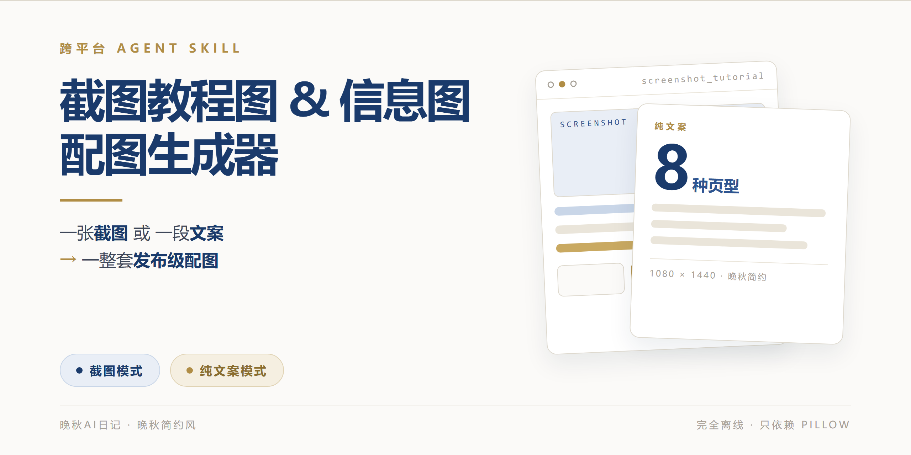
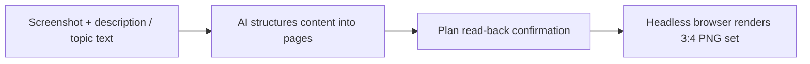

# 📸 Screenshot & Text → Infographic Generator

> **TL;DR**: You send **one screenshot** or **a paragraph of text**, and this AI skill generates a complete set of on-brand tutorial / infographic images — ready to post on Xiaohongshu, WeChat, or any community. No design or coding needed.

> 🇨🇳 中文文档：[README.md](README.md)

[](LICENSE)
[](requirements.txt)
[](CHANGELOG.md)



---

## What it solves

Making product tutorial images is tedious: manual cropping, inconsistent styling, time-consuming layout. This skill handles all of it:

| You provide | It returns |
|---|---|
| One screenshot + a feature description | 1 cover + 1 overview + several per-feature detail images |
| A paragraph of text (a topic) | 1 cover + several content-page infographics |

All images are **1080×1440 (3:4 portrait) high-res PNG** (rendered at 2× = 2160×2880), with consistent footers and page numbers.

Visual style is "late-autumn minimal": a single brand color (auto-derived from your screenshot in screenshot mode; default deep blue `#1A3A6B` in text mode) + muted gold accents + warm white background + 1px hairline separators. Pure typography, **works fully offline** — no illustration APIs, no OCR, no external services.

## Two modes

### Mode 1: Screenshot → Feature tutorial

Send a product screenshot + a feature description. Returns a minimal cover, an overview (features broken into cards), and per-feature detail pages (auto-cropped regions, zoomed in). Brand color is auto-derived from the screenshot's dominant color.

### Mode 2: Text → Infographic

Send a topic or copy. The AI structures it into pages and renders them with "semantic layouts" — visual elements that encode meaning: vertical chains = causality, timelines = evolution, comparison tables = differences, terminal-window flow diagrams (with connector lines, probability bars, option chips), big-number pages, and takeaway pages.

## Installation

Prerequisites: **Python 3.10+** and a Chromium-based browser (Edge on Windows, Chrome on macOS, Chromium on Linux).

```bash
git clone https://github.com/Wanqiu12345/screenshot-infographic-skill.git
cd screenshot-infographic-skill
python install.py          # creates an isolated .venv, installs Pillow, checks browser
```

Then copy the folder into your client's skill directory:

| Client | Directory |
|---|---|
| Claude Code | `~/.claude/skills/` |
| OpenAI Codex | `~/.agents/skills/` |
| WorkBuddy | `~/.workbuddy/skills/` |

### Verify the install

```bash
python run_text_tutorial.py        # renders the bundled demo to output_text/
python run_screenshot_tutorial.py  # renders the bundled demo screenshot to output/
```

If `00_cover.png` and friends appear in the output directory, you're set ✅.

## Usage

The recommended way is simply talking to your AI assistant:

> Use the `screenshot-infographic-skill` skill to make a feature tutorial set from this screenshot. Features: ... Brand name: ...

> Use the `screenshot-infographic-skill` skill to make an infographic set about: "What is X, explained simply".

Before generating anything, the skill **reads its plan back to you for confirmation** (page count, layout per page, copy direction, footer brand) — it would rather ask than produce wrong images.

CLI (for automation):

```bash
# Text mode: render a structured config JSON
python run_text_tutorial.py my_config.json --out my_output_dir
python run_text_tutorial.py my_config.json --out my_output_dir --only 03_page_name   # single page for debugging

# Screenshot mode: brand info via env vars
SCREENSHOT=/path/to/your.png BRAND_NAME="Your Product" python run_screenshot_tutorial.py
```

Config field reference for text mode lives in [SKILL.md](SKILL.md); a working example is [examples/wf_agent_v2.json](examples/wf_agent_v2.json).

## How it works


```mermaid
flowchart LR
    A[Screenshot + description / topic text] --> B[AI structures content into pages]
    B --> C[Plan read-back confirmation]
    C --> D[Headless browser renders 3:4 PNG set]
```

Key technical points:

- **Brand color auto-derivation**: dominant screenshot color desaturated and darkened into a single brand color (screenshot mode).
- **Semantic layouts**: pages fill 1080×1440 via `flex:1` — no large empty areas.
- **SAFE_ENV headless rendering**: minimal environment variables passed to the browser, avoiding crashes caused by injected `NODE_OPTIONS` / `ELECTRON_RUN_AS_NODE` in host environments.
- **Editable HTML kept**: every PNG has its HTML source preserved (`_html/` inside the output dir) for easy re-rendering after tweaks.

## Repository layout

```text
screenshot-infographic-skill/
├── SKILL.md                      # Main instructions + config field reference
├── run_screenshot_tutorial.py    # Screenshot mode entry
├── run_text_tutorial.py          # Text mode entry
├── install.py                    # One-command installer
├── scripts/
│   ├── text_v2.py                # Text mode renderer (7 page types)
│   ├── screenshot_v2.py          # Screenshot mode renderer
│   ├── render.py                 # Headless browser rendering (SAFE_ENV)
│   ├── social_post.py            # Bonus social-media copy generator
│   └── package_skill.py          # Distributable zip packer
├── assets/                       # README cover image
└── examples/                     # Demo inputs and outputs
```

## Notes & gotchas

- **A Chromium-based browser is required** for rendering. On headless Linux servers, install one first (`sudo apt-get install -y chromium` on Debian/Ubuntu). `render.py` auto-detects and passes `--no-sandbox` / `--disable-dev-shm-usage` for containers.
- Outputs go to `output/` (screenshot mode) and `output_text/` (text mode), both gitignored.
- All paths are relative (`__file__`-based) — the folder runs from anywhere.

## FAQ

**Q: What resolution are the images?**
A: 1080×1440 portrait 3:4, rendered at 2× (2160×2880).

**Q: Can I customize colors?**
A: Screenshot mode derives the brand color from your screenshot automatically. Text mode defaults to deep blue `#1A3A6B` + gold; override with the `primary` field in the config JSON.

**Q: Does it need internet or an image-generation API?**
A: No. Since v2.0.0 both modes are pure typographic rendering — fully offline after install.

**Q: Images have blank areas or misplacement?**
A: Check your config JSON field names first (e.g. timeline uses `nodes`, not `events`; chain `steps` are arrays, not dicts). Full reference in [SKILL.md](SKILL.md).

## Contributing / License

- PRs welcome — see [CONTRIBUTING.md](CONTRIBUTING.md).
- MIT License, see [LICENSE](LICENSE).
- Changelog: [CHANGELOG.md](CHANGELOG.md).

---

Made for people who hate making tutorial screenshots by hand. 🙌
